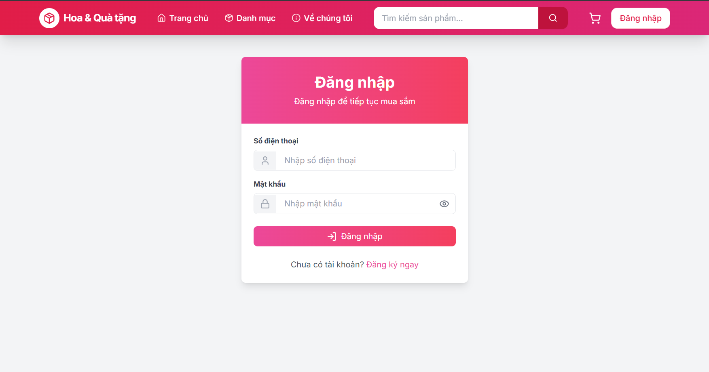
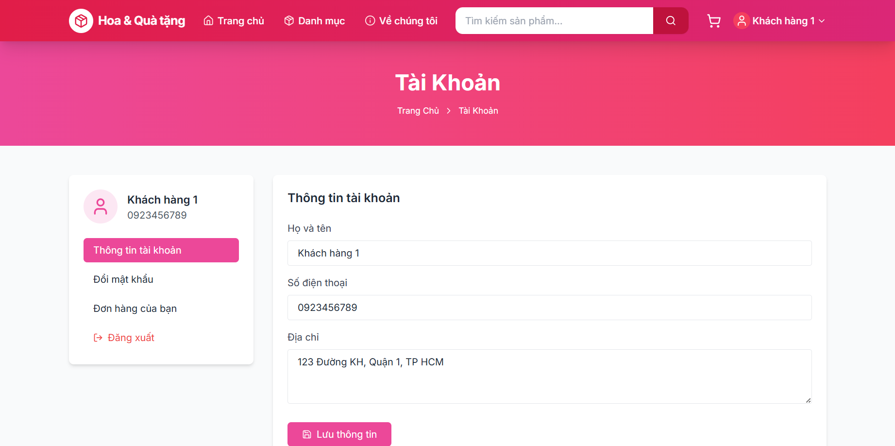
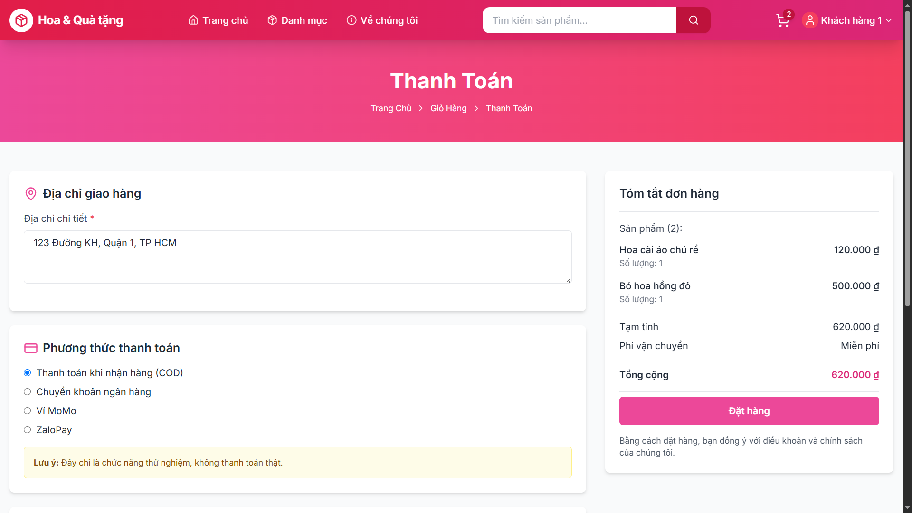
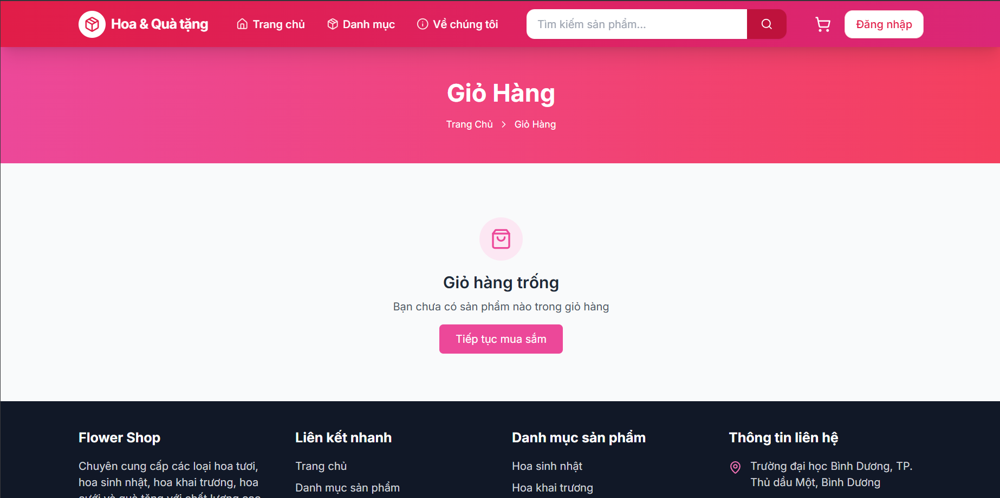
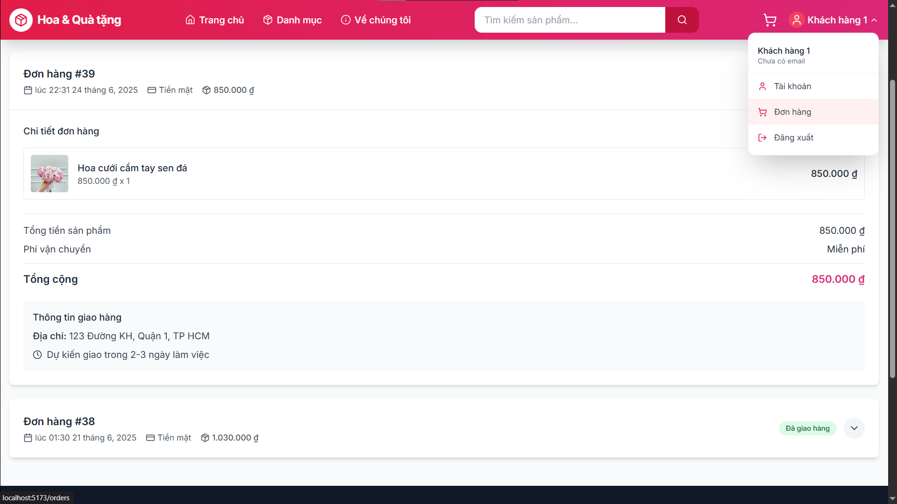
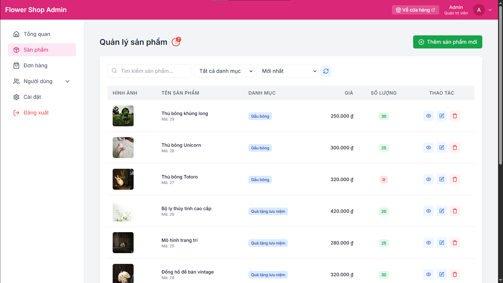
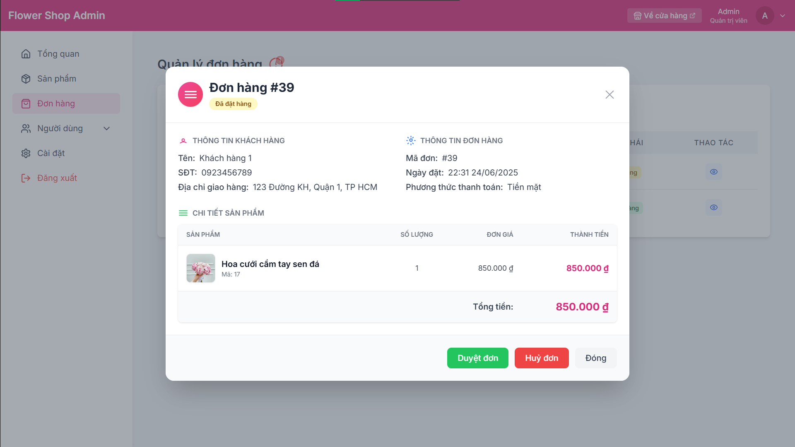

# 🛍️ Shop App - React E-commerce Solution

[](https://github.com/BlackDeathWind/shop-app/releases)
[](LICENSE)

**Ứng dụng web giao hoa và quà tặng**.

> **Live Demo**: (Hiện chưa có) (Google Drive)

## 🚀 Tính Năng Nổi Bật

| Module         | Chi Tiết                                                                 |
|----------------|--------------------------------------------------------------------------|
| **Xác thực**   | Đăng nhập/Đăng ký với API backend truy vấn tới SQL Server                |
| **Sản phẩm**   | Danh sách sản phẩm đa danh mục, Tìm kiếm, Lọc,                           |
| **Giỏ hàng**   | Quản lý giỏ hàng bằng weblocal (không phải lưu trong cơ sở dữ liệu)      |
| **Thanh toán** | Hoá đơn, Cập nhật số lượng sản phẩm khi thanh toán thành công            |
| **Hồ sơ**      | Theo dõi đơn hàng, Lịch sử mua hàng, Cập nhật thông tin cá nhân          |
| **Quản trị**   | CRUD sản phẩm (Admin Dashboard + Nhân viên Dashboard - riêng biệt)       |

## 📱 Hình Ảnh Demo

| Đăng Nhập            | Trang Chủ           | Hồ Sơ             |
|----------------------|---------------------|-------------------|
|  |  |  |

| Thanh Toán          | Giỏ Hàng            | Hoá đơn            |
|---------------------|---------------------|--------------------|
|  |  |  |

| Admin Dashboard     | Quản lý sản phẩm    | Quản lý đơn hàng   |
|---------------------|---------------------|--------------------|
|  |  |  |

## 🛠 Công Nghệ Sử Dụng


**Frontend Framework**  
- React 19 (TypeScript)
- Vite (cho phát triển React + TypeScript)

**Backend**
- Node.js – Nền tảng chạy server-side JavaScript.
- Express.js – Framework xây dựng chính cho backend, tổ chức theo mô hình MVC.
- TypeScript – Dễ bảo trì, phát triển lâu dài.
- Sequelize ORM – Quản lý truy vấn và ánh xạ dữ liệu giữa Node.js và cơ sở dữ liệu.
- JWT (JSON Web Token) – Xác thực và phân quyền người dùng (Admin - Nhân viên - Khách hàng).
- Multer – Xử lý upload file (hình ảnh sản phẩm).
- Bcrypt – Mã hoá mật khẩu người dùng vào SQL Server.
- CORS, Helmet, v.v. – Bảo mật API.

**Database**
- Microsoft SQL Server – Lưu trữ dữ liệu.
- Sequelize – ORM mapping giữa các model TypeScript và bảng dữ liệu.

**UI/UX Libraries**  
- Tailwind CSS – Framework CSS utility-first.
- Lucide React – Bộ icon vector hiện đại.
- Custom Toast/Notification – Hệ thống thông báo.
- React Router DOM v7 – Routing động, bảo vệ route, phân quyền truy cập.
- Context API + Custom Hooks – Quản lý trạng thái xác thực, giỏ hàng, toast, v.v.

**Payment (thanh toán)**  
- Thanh toán giả lập, không thật (Test Mode).

## ⚙️ Cài Đặt Dự Án

### Yêu Cầu Hệ Thống
- Node.js (>= 14)

### Bước 1: Clone repository (tải dự án này về máy, bật Terminal của Visiual Studio Code hoặc các IDE khác để nhập lệnh)
```bash
git clone https://github.com/BlackDeathWind/shop-app.git
cd shop-app
```

### Bước 2: Cài đặt dependencies
```bash
# Tham chiếu đến thư mục frontend bằng cách:
cd frontend
```
```bash
# Sau khi tới đường dẫn frontend rồi thì thiết lập thư viện cần thiết (yêu cầu có ứng dụng Node.js trong máy):
npm install
```
```bash
# hoặc (Tuỳ, nhưng khuyến khích npm install)
yarn install
```
```bash
# Sau đó quay về thư mục gốc bằng cách:
cd ..
```
```bash
# Tiếp theo tham chiếu đến thư mục backend bằng cách:
cd backend
```
```bash
# Sau đó thiết lập thư viện cần thiết (yêu cầu có ứng dụng Node.js trong máy):
npm install
```

### Bước 3: Khởi chạy ứng dụng (lưu ý khởi chạy cả 2 frontend và backend cùng một lúc)
```bash
# ở Console Terminal frontend (cd frontend):
npm run dev
```
```bash
# ở Console Terminal backend (cd backend):
npm run dev
```
- Frontend sẽ chạy ở http://localhost:5173/
- Backend sẽ chạy ở http://localhost:5000/

## 📁 Cấu Trúc Thư Mục Chính
```bash
── src/
    ├── config/          # Cấu hình hệ thống, database
    ├── controllers/     # Controller xử lý request/response
    ├── interfaces/      # Định nghĩa interface, kiểu dữ liệu
    ├── middlewares/     # Middleware xác thực, upload, ...
    ├── models/          # Định nghĩa model ORM (Sequelize)
    ├── routes/          # Định nghĩa các route (endpoint)
    ├── services/        # Xử lý logic nghiệp vụ, truy vấn DB
    └── utils/           # Hàm tiện ích, helper, logger, ...
```

## 🔧 Biến Môi Trường (3 tệp .sql mình đã chuẩn bị xẵn trong dự án, lưu ý chạy từng câu lệnh trong tệp đó trong SQL Server)
Tạo file mới ghi là `.env` tại thư mục backend (Lưu ý điền thông tin của SQL Server theo hướng dẫn):
```env
PORT=5000
NODE_ENV=development

# Database
DB_HOST=Điền server name
DB_PORT=1433
DB_NAME=tên data base
DB_USER=sa
DB_PASSWORD=mật khẩu ghi ở đây

# JWT
JWT_SECRET=shopapp_secret_key
JWT_EXPIRES_IN=7d
```

## 👨‍💻 Tác Giả
**Phạm Nguyễn Chu Nguyên - 21050043**  
[](https://github.com/BlackDeathWind)
[(hiện chưa có)

## 📜 Giấy Phép
Dự án được cấp phép theo [MIT License](LICENSE)
```
## 💡 Lưu Ý Quan Trọng
Bước Cài đặt dependencies và bước thiết lập Biến Môi Trường
```

2. **Performance Optimization**: Đã áp dụng các kỹ thuật:
   - Lazyload cho mục đích load sản phẩm lên giao diện mượt mà thay vì load toàn bộ cùng một lúc và liên tiếp như vậy.
   - Code splitting từng tệp để dễ quản lý và bảo trì

3. **Các vấn đề đang phát triển (Kinh nghiệm và hạn chế)**:
   - Chưa có kinh nghiệm xây dựng các lớp bảo mật nhiều tầng cho dự án dạng e-commerce này.
   - Chưa Deloy (triễn khai dự án) lên AWS hay Vercel (hiện chạy localhost).
   - Chưa có kinh nghiệm xử lý thanh toán thật.
